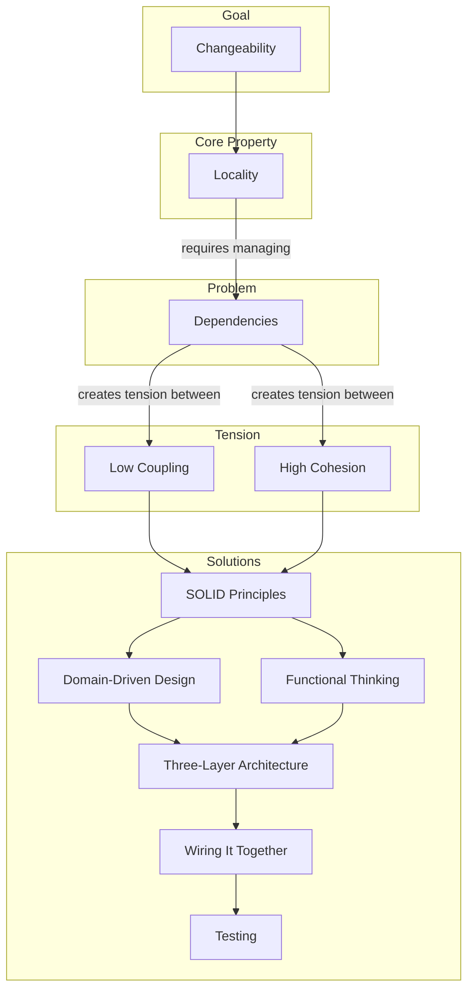

# Software Design Philosophy

**Part 1 of 8: The AtomiCloud Engineering Series**

_This is the first article in an eight-part series covering the principles, patterns, and practices behind every AtomiCloud codebase. Start here if you are new -- everything else builds on these ideas._

1. **Software Design Philosophy** (you are here)
2. [The Dependency Model](./part-2-dependency-model.md)
3. [SOLID Principles](./part-3-solid-principles.md)
4. [Functional Thinking](./part-4-functional-thinking.md)
5. [Domain-Driven Design](./part-5-domain-driven-design.md)
6. [Three-Layer Architecture](./part-6-three-layer-architecture.md)
7. [Wiring It Together](./part-7-wiring-it-together.md)
8. [Testing and Testability](./part-8-testing-and-testability.md)

---

## The Goal of Software

Here is a question that sounds obvious until you try to answer it precisely: what makes software valuable?

It is not speed. Hardware is faster. It is not reliability. A mechanical switch is more reliable than any program. It is not even correctness -- a hardcoded lookup table is more correct than a calculation engine, for the inputs it covers.

What makes software valuable is that it is **easy to change**.

Pure hardware and other forms of automation can perform the same tasks. A circuit board can route signals. A conveyor belt can sort packages. But changing a circuit board means redesigning it, manufacturing it, and shipping it. Changing software means editing a file and deploying it. That difference -- the ability to evolve quickly -- is why software dominates the modern world.

This means the most important property of a codebase is how easy it is to change **tomorrow**. A codebase that is easy to change lets you ship features faster, fix bugs with confidence, and onboard new team members without fear. A codebase that is hard to change punishes you for every decision you made six months ago.

Software that is hard to change is just expensive hardware. You paid for flexibility and got rigidity. Everything in this series -- every principle, every pattern, every rule -- exists to protect that flexibility.

---

## Locality: The Core Property

So how do you make code easy to change? You make it easy to understand.

**Locality** is the property that, within a bounded scope, you can understand everything you need without looking outside that scope.

Think of it like a physicist studying a magnetic field. When calculating the force at a specific point, they don't need to know the state of every particle in the universe. They only need to know the field in the area of interest. The field is an abstraction that captures all the relevant information locally.

```
Without locality:      To understand A, you must understand B, C, D, E...
                       To understand B, you must understand F, G, H...
                       (infinite regress)

With locality:         To understand A, you only need what's in A's boundary
                       The boundary hides complexity you don't need
```

Achieving locality requires two operations:

1. **Create boundaries** that split unrelated things apart
2. **Group related things** together inside those boundaries

The art of software design is deciding where to draw these boundaries. Draw them too small, and you fragment the system into useless pieces. Draw them too large, and you couple things that should evolve independently.

These two operations have names. **Cohesion** is about grouping related things -- code that changes for the same reason should live in the same place. If you are updating tax calculation rules, all the tax code should be in one module. You should not have to edit five files scattered across the codebase to make one conceptual change. When cohesion is low, a single change ripples everywhere. You touch the billing module, the shipping module, the notification module -- not because they are genuinely related, but because the code was organized poorly. Every change becomes a research project.

**Coupling** is the flip side -- keeping unrelated things separate. Modules that have nothing to do with each other should not depend on each other. If you change the logging format, that should not break the payment processor. If you update the database schema, that should not affect the email templates. When coupling is high, changes cascade unexpectedly. You change a field name and suddenly three unrelated features break. You add a column to a table and the authentication system stops working. The connections were there, but you could not see them.

---

## How These Ideas Relate



This is the map for the whole series. We start with changeability as the goal. Locality is what makes changeability practical. Dependencies are the thing we need to manage to get locality. Coupling and cohesion are the two forces pulling in opposite directions when we manage those dependencies. And then the rest of the series -- SOLID, functional thinking, DDD, the three-layer architecture, wiring, and testing -- are the tools we use to navigate that tension.

---

## The Empirical Observation

These ideas did not emerge from theory. They emerged from observation.

Watch any team working on a mature codebase. You will notice patterns:

- Some files change together frequently. Edit one, and you must edit the others. This is high cohesion in action -- related things living together.
- Some files break unexpectedly when you touch seemingly unrelated code. This is high coupling -- hidden dependencies causing fragility.
- Some modules are easy to understand in isolation. Read the constructor, and you know everything it needs. This is locality.
- Some modules require tracing through seventeen files to understand one function. This is failed locality.

The principles in this series are formalizations of these observations. They give us vocabulary to discuss what we already intuitively know: code that is easy to change has good locality, low coupling, and high cohesion.

---

## Two Symptoms of Poor Locality

When locality breaks down, you see two symptoms:

**Fragility** -- you change one thing, and unrelated things break. The symptom is far from the cause. You spend hours debugging, only to discover the real problem was in a completely different module. This happens when coupling is too high -- unrelated things are tangled together.

**Rigidity** -- you want to make a simple change, but it requires touching many places. The code you need is scattered everywhere. You end up duplicating logic because extracting it is too painful. This happens when cohesion is too low -- related things are spread apart.

Both symptoms trace back to the same root: code that should be together is apart, and code that should be apart is together.

---

## The Role of Dependencies

Why does locality break down?

The answer is **dependencies**. When code A depends on code B, they are connected. A cannot be understood without understanding B. A cannot change without considering B. The dependency creates a relationship.

Dependencies are unavoidable. You cannot write useful code without calling other functions, using other modules, reading from databases. The question is not whether dependencies exist, but whether they are **placed well**.

A well-placed dependency connects things that are genuinely related -- they change together, they belong together. This improves locality because the connection reflects reality.

A poorly-placed dependency connects things that are unrelated -- they change for different reasons, they belong in different places. This harms locality because now distant things are coupled.

---

## What Comes Next

We have established:

**Changeability** is the most important property of software.

**Locality** is the practical goal -- keeping related things together and unrelated things apart. When locality is good, changes are predictable and contained.

**Dependencies** are what connect code. Well-placed dependencies improve locality; poorly-placed dependencies harm it.

The rest of this series is about how to place dependencies well. [Part 2: The Dependency Model](./part-2-dependency-model.md) introduces a framework for thinking about dependencies -- how explicit they are, how flexible they are, and what makes some dependencies better than others.

---

_Previous: (start of series) | Next: [Part 2: The Dependency Model](./part-2-dependency-model.md)_
