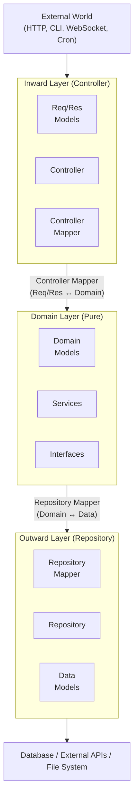
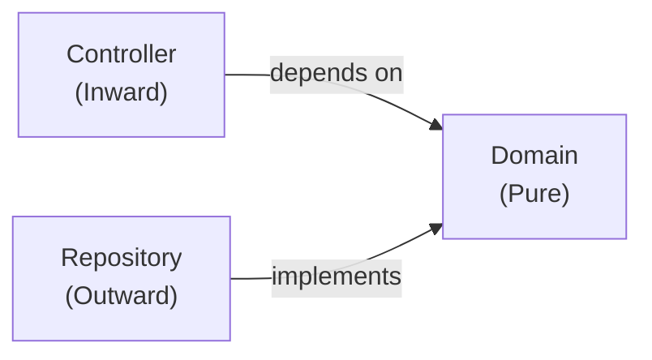

# Three-Layer Architecture

**Part 6 of 8: The AtomiCloud Engineering Series**

_The domain is pure. Everything else is a plugin. This part shows how to wrap the domain in layers that connect it to the real world -- databases, APIs, message queues -- while keeping the core clean and testable._

1. [Software Design Philosophy](./part-1-software-design-philosophy.md)
2. [The Dependency Model](./part-2-dependency-model.md)
3. [SOLID Principles](./part-3-solid-principles.md)
4. [Functional Thinking](./part-4-functional-thinking.md)
5. [Domain-Driven Design](./part-5-domain-driven-design.md)
6. **Three-Layer Architecture** (you are here)
7. [Wiring It Together](./part-7-wiring-it-together.md)
8. [Testing and Testability](./part-8-testing-and-testability.md)

---

## Why Three Models for the Same Concept?

I have a problem with "DRY." Not the principle itself -- the way people apply it. "Don't Repeat Yourself" is fine as a starting point, but developers treat it like a commandment and start merging things that look similar but are not actually the same thing.

Here is my challenge to you: **things that look exactly alike might not be repetition at all.** Remember the Single Responsibility Principle from [Part 3](./part-3-solid-principles.md)? Two pieces of code that happen to look identical but change for different reasons are not duplicates. They are coincidences.

Consider a `User` concept in a typical web application:

```
// API Request/Response
{ "email": "alice@example.com", "password": "secret123" }

// Domain Model
User { email: Email, passwordHash: HashedPassword }

// Database Row
{ email: "alice@example.com", password_hash: "$2b$12..." }
```

These look similar. A naive developer might say "this is repetition, let us use one model everywhere." But they change for different reasons:

- The **API model** changes when mobile developers request a different field format, or when you version your API
- The **domain model** changes when business rules evolve -- password complexity requirements, email validation logic
- The **database model** changes when the DBA optimizes queries, adds indexes, or migrates to a new schema

Using one model couples all these concerns. A change to the API response format could break the database query. That is not DRY; that is coupling wearing DRY's clothes.

**The real question is: do these change for the same reason?** If not, they should be separate, even if they look identical today.

---

## The Plugin Architecture

The three-layer architecture is, at its core, a plugin architecture. The domain is the core. Everything else -- HTTP handlers, database adapters, message queue consumers -- is a plugin that can be swapped without the domain knowing.

### The Pattern That Emerges

Start with the domain. A `PostService` that creates posts, validates rules, returns results. Pure. Tested.

```
class PostService(repo: IPostRepository):
  create(record: PostRecord): Result<Post, PostError>
```

The service depends on `IPostRepository` -- an interface. The domain _defines_ the interface but does not _implement_ it. It is a promise: "someone will provide this capability."

When you need persistence, you add a layer **outward**:

```
class PostgresPostRepository(db: Database): IPostRepository
  create(record: PostRecord): Result<Post, PostError>
    // translate domain types to database types, execute query, translate back
```

The domain did not change. You added a module that fulfills its promise.

When you need an API, you add a layer **inward**:

```
class PostController(service: PostService, mapper: PostControllerMapper)
  handleCreate(httpReq: HttpRequest): HttpResponse
    // parse request, map to domain, call service, map response
```

Again, the domain did not change. You added a module on the other side.

The pattern: **domain in the center, persistence grows outward, APIs grow inward.** The domain stays untouched.

---

## The Three Layers



And the dependency direction is critical -- **all arrows point inward toward the domain**:



The controller depends on the domain (it calls domain services). The repository depends on the domain (it implements domain interfaces). The domain depends on nothing external. This is Dependency Inversion from [Part 3](./part-3-solid-principles.md) applied at the architecture level.

### Inward Layer (Controller)

Controllers receive events and instructions from outside the system: HTTP requests, CLI commands, WebSocket messages, cron triggers. Their job is narrow and mechanical:

1. Parse incoming input
2. Map it to domain types (via the controller mapper)
3. Call the domain service
4. Map the domain response to output format
5. Return it

Controllers contain **zero business logic**. They are thin wiring. An HTTP controller and a CLI controller can call the exact same domain service -- the only difference is how they parse input and format output.

If you find business logic creeping into a controller -- validation beyond "is this valid JSON?", conditional logic based on domain rules -- that is a smell. Push it down into the domain.

### Domain Layer (Pure)

The domain layer is the source of truth. All business rules live here.

Three constraints:

1. **No IO** -- no database calls, no HTTP requests, no file reads
2. **No knowledge of outer layers** -- no imports of controller or repository types
3. **Interfaces for external needs** -- when the domain needs something from outside, it defines an interface; the outward layer implements it

Because the domain has no IO, it is **fully testable** with mocked dependencies. You do not need a running database or a test server. This is the reason the entire architecture exists.

### Outward Layer (Repository)

Repositories implement the interfaces the domain defines. They handle the messy details: connection pooling, retries, serialization, error translation.

The domain never sees database exceptions or network errors. Repositories catch infrastructure errors and map them to domain error types. A `SqlTimeoutException` becomes a `PostError.StorageFailure`. The domain only speaks its own language.

---

## Separate Models Per Layer

Each layer has its own models. This feels like overhead until the day it saves you.

### The Story

Six months in, the PM says: "Change the API. `createdAt` should be a Unix timestamp, not an ISO string. And rename `couponCode` to `discountCode`."

If your controller uses the domain model directly, you touch domain code for what is purely an API formatting requirement. Domain tests might break. The repository might get confused. The change cascades.

If your controller has its own models and a mapper, you change one mapper function. Domain untouched. Repository untouched. Change contained.

### Controller Models (Request/Response)

Optimized for the transport protocol. Strings, numbers, simple structures. Validation annotations. Serialization hints.

```
record CreatePostReq:
  title: string
  description: string
  tags: string[]

record PostRes:
  id: string
  title: string
  description: string
  tags: string[]
  authorName: string
  createdAt: string       // ISO 8601 for the wire
```

### Domain Models (Rich Types)

Use the richest types the language offers. Validated newtypes. Discriminated unions. Proper enums.

```
record PostRecord:
  title: PostTitle         // Validated, non-empty, max 200 chars
  description: string
  tags: Tag[]              // Typed, not raw strings
```

### Data Models (Storage-Optimized)

Shaped for the persistence layer. Foreign keys instead of nested objects. JSON-serialized columns. Database-native timestamps.

```
record PostData:
  id: UUID
  author_id: UUID           // Foreign key, not a nested object
  title: string             // Plain string for column
  tags: string              // JSON-serialized array
  created_at: timestamp
```

### The Impact

| Scenario          | Shared models                          | Separate models                           |
| ----------------- | -------------------------------------- | ----------------------------------------- |
| Change API format | Touch domain and possibly repository   | Update controller mapper only             |
| Change DB schema  | Touch domain and possibly controller   | Update repository mapper only             |
| Add CLI interface | Modify domain to accommodate CLI needs | Add CLI models + mapper, domain untouched |
| Switch database   | Touch all layers                       | Update repository only                    |

---

## Mappers Between Boundaries

Mappers are pure functions that translate between layers. They are small, boring, and extraordinarily valuable. When things go wrong, you look at the mapper. When requirements change, you update the mapper. The rest of the system stays stable.

### Controller Mapper

```
module PostControllerMapper:
  toRecord(req: CreatePostReq): PostRecord
  toRes(post: Post): PostRes
```

Converts incoming requests to domain inputs, and domain outputs to responses. This is where you handle things like "the API uses `discountCode` but the domain calls it `couponCode`" -- a renaming that costs one line in the mapper instead of a project-wide refactor.

### Repository Mapper

```
module PostDataMapper:
  toData(principal: PostPrincipal): PostData
  toDomain(data: PostData, authorData: AuthorData): Post
```

Converts domain models to storage format, and storage format back to domain. This is where JSON serialization of array columns happens, where foreign keys get resolved into nested objects, where database nulls get translated to domain optionals.

---

## Error Flow

Errors flow through the same boundaries as data, translated at each layer.

### At the Repository

The repository catches infrastructure errors and maps them to domain errors:

```
class PostgresPostRepository(db: Database): IPostRepository:
  create(record: PostRecord): Result<Post, PostError>:
    try:
      data = toData(record)
      db.posts.insert(data)
      return Ok(toDomain(data))
    catch e: DatabaseException:
      return Err(PostError.StorageFailure(e.message))
```

Infrastructure exceptions stop at the boundary. The domain only sees domain error types.

### At the Controller

The controller maps domain errors to transport errors. For HTTP, this typically means Problem Details (RFC 9457):

```
mapError(error: PostError): HttpResponse:
  match error:
    PostError.EmptyTitle =>
      ProblemDetails(status: 400, type: ".../empty_title", ...)
    PostError.NotFound(id) =>
      ProblemDetails(status: 404, type: ".../not_found", ...)
    PostError.StorageFailure(msg) =>
      ProblemDetails(status: 500, type: ".../internal_error", ...)
```

The same domain error becomes a 400 for HTTP, a formatted message for CLI, an error frame for WebSocket. The domain does not know or care which transport is in use.

See [Part 4: Functional Thinking](./part-4-functional-thinking.md) for the `Result` type and compositional error handling patterns.

---

## The Framework Question

At this point, a very natural objection comes up: "This is a lot of ceremony. We are never going to change our framework. Why guard against something that will not happen?"

Fair point. And you are right -- you are probably not going to switch from Express to Fastify, or from ASP.NET to Spring Boot. Framework migrations are rare and dramatic.

But here is the thing: **you do not need to switch frameworks to feel this pain. You just need to upgrade.**

Think about it. Your application is built on Laravel 2. The framework works fine, but Laravel 3 introduces significant improvements -- better performance, security patches, features your team needs. You want to upgrade.

If your business logic is tightly coupled to Laravel:

- Every controller directly uses Laravel's `Request` object in domain logic
- Every service reaches for Laravel's `Config` facade
- Every repository returns Laravel's `Collection` type

The upgrade requires touching every file. You are not upgrading; you are rewriting -- disguised as a version bump.

If your business logic is isolated behind interfaces:

- Controllers are thin wrappers that parse Laravel requests and call domain services
- Domain services depend on interfaces, not Laravel implementations
- Repositories use Laravel's ORM internally but return domain types

The upgrade requires updating the adapter implementations -- the boundary plugins. The domain layer, where all your actual business logic lives, is untouched.

A major version bump is, effectively, a framework change. The APIs shift, the contracts break, the internals reorganize. And **upgrading is inevitable** -- security patches alone guarantee it. The cost of upgrading should not scale with the size of your codebase. It should scale with the size of your boundary layer.

This architecture is not about guarding against a hypothetical framework switch. It is about making the _routine_ act of upgrading fast and safe. It forces you not to weave framework code across the domain. When the time comes -- and it always comes -- you change the boundary plugins and move on.

---

## Quick Checklist

| Concern              | Check                                                      |
| -------------------- | ---------------------------------------------------------- |
| Three layers         | Controller (inward) / Domain (pure) / Repository (outward) |
| Domain purity        | Zero IO in domain layer                                    |
| Interface boundaries | Domain defines interfaces; outward layer implements them   |
| Separate models      | Each layer has its own model types                         |
| Controller mapper    | Req/Res ↔ Domain translation                              |
| Repository mapper    | Domain ↔ Data translation                                 |
| Error boundaries     | Repository maps infrastructure errors to domain errors     |
| Error translation    | Controller maps domain errors to transport errors          |
| Dependency direction | All arrows point inward toward domain                      |

---

## What Comes Next

The architecture is set. We have a pure domain, controllers that receive input, repositories that persist data, and mappers at every boundary. The error flow is clean. The models are separated.

What remains is the mechanics: how services are actually constructed, how the composition root wires everything together, how the whole machine starts running.

[Part 7: Wiring It Together](./part-7-wiring-it-together.md) covers the composition root -- the big bang of dependency injection where all layers are assembled and the engine comes to life.

---

_Previous: [Part 5: Domain-Driven Design](./part-5-domain-driven-design.md) | Next: [Part 7: Wiring It Together](./part-7-wiring-it-together.md)_
