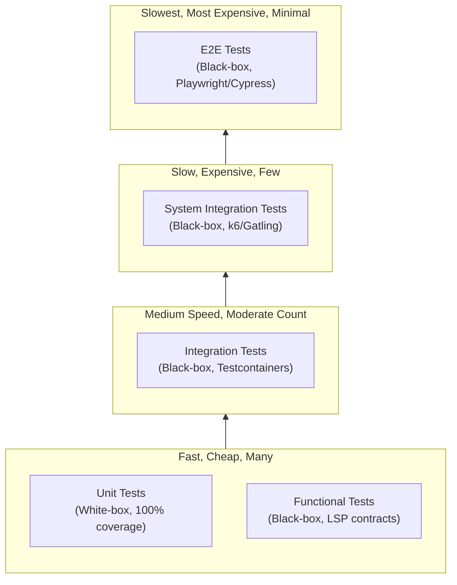

# Testing and Testability

**Part 8 of 8: The AtomiCloud Engineering Series**

_Parts 1 through 7 gave us philosophy, principles, patterns, domain modeling, architecture, and wiring. Now the question: how do you know it works? This part shows how the design we have built makes testing straightforward -- and why testability is the proof that the design works._

1. [Software Design Philosophy](./part-1-software-design-philosophy.md)
2. [The Dependency Model](./part-2-dependency-model.md)
3. [SOLID Principles](./part-3-solid-principles.md)
4. [Functional Thinking](./part-4-functional-thinking.md)
5. [Domain-Driven Design](./part-5-domain-driven-design.md)
6. [Three-Layer Architecture](./part-6-three-layer-architecture.md)
7. [Wiring It Together](./part-7-wiring-it-together.md)
8. **Testing and Testability** (you are here)

---

## Why Tests Matter

A test is a second opinion on your code. You write a function, you think it works. Then you write a test that calls it with specific inputs and checks the output. The test asks a different question: not "how do I make this work?" but "does this actually do what I intended?"

A codebase without tests has been checked exactly once -- by the person who wrote it, in the moment they wrote it. The off-by-one error, the forgotten null check, the empty list case -- these slip through because one pass is never enough.

A codebase with tests is checked twice, and the second check runs every time the code changes. Forever.

But here is the deeper insight, and the real reason this part exists: **if code is hard to test, it is hard to change.** The properties that make code testable -- explicit dependencies, immutable data, pure functions, injectable collaborators -- are exactly the properties that make code changeable. This entire series has been building toward code that is easy to test. Testing is not a separate concern bolted on at the end. It is the _proof_ that the design works.

If you followed the principles in Parts 1 through 7 and your code is still hard to test, something went wrong in the design. The tests are telling you.

---

## The Test Pyramid

The shape of the pyramid is deliberate: tests at the bottom are fast, cheap, and numerous. Tests at the top are slow, expensive, and few. A healthy codebase has many unit tests, some functional tests, fewer integration tests, and a minimal number of SIT/E2E tests.



Why this shape? Because of a fundamental trade-off: the higher you go, the more confidence you get that the _whole system_ works, but the slower and more brittle the tests become. A unit test runs in milliseconds and tells you exactly which function broke. An E2E test takes seconds (or minutes), and when it fails, you have to hunt through the entire stack to find the culprit.

The strategy is to **catch as many bugs as possible at the lowest level**, then use higher levels only for things that lower levels cannot catch.

---

## Unit Tests (White-Box)

Unit tests examine the internal implementation of a single class or function. They are white-box -- they know about dependencies and internal structure. They aim for **100% code coverage**.

"Wait, 100%? Isn't that excessive?" you might ask. If your classes follow SRP and your methods are small, 100% coverage is trivially achievable. If it feels excessive, the class is probably doing too much. The difficulty of achieving coverage is, itself, design feedback.

### The AAA Pattern

Every unit test follows the same structure: **Arrange, Act, Assert**.

```
describe('PostService', () => {
  it('should create post with valid title', () => {
    // Arrange - set up the subject, inputs, expected result
    const mockRepo = { create: (r) => Ok(mockPost) };
    const subject = new PostService(mockRepo);
    const input = { title: 'Hello', description: 'World', tags: [] };
    const expected = mockPost;

    // Act - call the method under test
    const actual = subject.create(input);

    // Assert - verify the result
    actual.should.eql(Ok(expected));
  });
});
```

Three sections. Clean separation. When a test is hard to write, the difficulty usually shows up in **Arrange** -- too many collaborators to set up, too much state to initialize. That is not the test's fault. That is the design telling you the class has too many responsibilities.

### Standard Variable Names

| Variable   | Meaning                             |
| ---------- | ----------------------------------- |
| `subject`  | The class or function being tested  |
| `input`    | Data passed to the method           |
| `expected` | What we expect the method to return |
| `actual`   | What the method actually returned   |

These names are a team convention. When every test uses them, you can scan any test file and immediately know what is being tested, what goes in, and what comes out.

### Triangulation: Why One Test Case Is Not Enough

A single test case can pass by accident. Maybe the implementation is hardcoded. Maybe it works for that specific input but breaks for everything else. Multiple cases prove correctness.

```
// Risky - single case, might pass by luck
it('should format status', () => {
  expect(formatStatus('pending')).toBe('Pending');
});

// Better - multiple cases prove the logic
it.each([
  ['pending', 'Pending'],
  ['running', 'Running'],
  ['completed', 'Completed'],
])('should format status (%s -> %s)', (input, expected) => {
  expect(formatStatus(input)).toBe(expected);
});
```

This is triangulation: you test enough cases that the only reasonable implementation is the correct one.

### Deterministic and Fast

Unit tests must be:

- **Deterministic** -- no random values, no real time, no network calls
- **Fast** -- no sleep, no real IO
- **Isolated** -- no dependence on test execution order

```
// Wrong - uses real time (slow, flaky)
it('should timeout after 1 second', async () => {
  const start = Date.now();
  await subject.doSomething();
  const elapsed = Date.now() - start;
  expect(elapsed).toBeGreaterThan(1000);
});

// Right - uses injected clock (fast, deterministic)
it('should timeout after deadline', () => {
  const clock = new FakeClock();
  const subject = new Service(clock);
  clock.tick(1001);
  subject.hasTimedOut().should.be.true();
});
```

If you need to inject a clock to test time-dependent logic, that is not a hack -- that is the architecture working as intended. The dependency was injectable ([Part 2](./part-2-dependency-model.md)), so the test controls it.

---

## Functional Tests (Black-Box)

Functional tests verify behavior through interfaces. They do not know about internal implementation -- only inputs, outputs, and the interface contract.

Here is the key difference from unit tests: a unit test knows _how_ the class works internally. A functional test only knows _what_ the interface promises.

### Why Functional Tests Matter

Functional tests validate the **interface contract**. They ensure that any implementation of the interface will behave correctly. This is the essence of the Liskov Substitution Principle from [Part 3](./part-3-solid-principles.md) -- if you can swap implementations, you need tests that prove the swap is safe.

```
// The interface
interface IPaymentProcessor:
  charge(amount: Money, card: CardDetails): Result<Charge, PaymentError>
  refund(chargeId: string): Result<Refund, PaymentError>

// Functional test - tests the contract, not a specific implementation
describe('IPaymentProcessor contract', () => {
  function testContract(createProcessor: () => IPaymentProcessor):
    it('should charge successfully with valid card', () => {
      const subject = createProcessor();
      const result = subject.charge(Money.usd(10.00), validCard);
      expect(result.isOk()).toBe(true);
    });

    it('should reject invalid card', () => {
      const subject = createProcessor();
      const result = subject.charge(Money.usd(10.00), invalidCard);
      expect(result.isErr()).toBe(true);
    });

  // Run the same contract tests against every implementation
  describe('StripePaymentProcessor', () => {
    testContract(() => new StripePaymentProcessor(mockStripeClient));
  });

  describe('PaypalPaymentProcessor', () => {
    testContract(() => new PaypalPaymentProcessor(mockPaypalClient));
  });
});
```

The beauty of this pattern: when you add a new implementation of `IPaymentProcessor`, you just add one more `describe` block pointing at the existing contract tests. The contract is defined once and verified everywhere.

### Unit vs Functional: Same Folder, Different Purpose

In practice, unit tests and functional tests often live side by side. But they test different things:

| Aspect      | Unit Test                  | Functional Test      |
| ----------- | -------------------------- | -------------------- |
| Knows about | Internal dependencies      | Interface only       |
| Mocks       | All collaborators          | All collaborators    |
| Validates   | Implementation correctness | Contract correctness |
| Fails when  | Code bug                   | Interface violation  |

---

## Integration Tests

Integration tests verify that modules work together correctly. Unit tests prove individual pieces work; integration tests prove the **wiring** between them works.

### Why Not Just Unit Tests?

You can have a perfectly unit-tested `PostService` and a perfectly unit-tested `PostgresPostRepository`, and the system still breaks because the mapper between them has a subtle bug -- maybe it swaps `created_at` and `updated_at`, or serializes tags as a comma-separated string instead of JSON.

Integration tests catch these boundary errors.

### Example: Repository + Database

```
describe('PostgresPostRepository', () => {
  let db: TestDatabase;
  let subject: PostgresPostRepository;

  beforeAll(async () => {
    db = await TestDatabase.create();       // Testcontainers spins up a real Postgres
    subject = new PostgresPostRepository(db.connection);
  });

  afterAll(async () => {
    await db.cleanup();
  });

  it('should persist and retrieve', async () => {
    const created = await subject.create(validRecord);
    const retrieved = await subject.get(created.value.principal.id);
    retrieved.value.should.eql(created.value);
  });
});
```

Integration tests test **module by module**, not the whole system at once. A repository integration test uses a real database (via Testcontainers) but still mocks external services like payment processors.

---

## SIT (System Integration Testing)

SIT tests the **entire system from a client's perspective**. This is fully black-box testing: the test has no access to the code, no coverage metrics, only the external API. It is, essentially, what your users will experience -- minus the UI.

### Why SIT?

Integration tests verify pairs of modules. SIT verifies that the entire assembled system works when deployed. This catches things that no lower-level test can:

- Configuration errors ("the environment variable was named differently in production")
- Wiring mistakes ("the DI container registered the wrong implementation")
- Environment-specific issues ("this query works locally but times out against the production database")
- Performance problems under load

### Example with k6

```javascript
// k6 script - tests from outside the system
import http from 'k6/http';
import { check } from 'k6';

export default function () {
  // Create order
  const createRes = http.post(
    'https://api.example.com/orders',
    JSON.stringify({
      items: [{ productId: 'widget-1', quantity: 2 }],
    }),
    {
      headers: { 'Content-Type': 'application/json' },
    },
  );

  check(createRes, {
    'create returns 201': r => r.status === 201,
    'create returns order id': r => r.json('id') !== undefined,
  });

  const orderId = createRes.json('id');

  // Get order
  const getRes = http.get(`https://api.example.com/orders/${orderId}`);

  check(getRes, {
    'get returns 200': r => r.status === 200,
    'get returns correct order': r => r.json('id') === orderId,
  });
}
```

### No Coverage Metrics

SIT is black-box. You cannot measure code coverage, and you should not try. Instead, you measure:

- Response times (are they within SLA?)
- Error rates (are they below threshold?)
- Throughput (can the system handle expected load?)
- User journey completion (do the critical flows work end-to-end?)

---

## E2E (End-to-End Testing)

E2E tests verify the **entire user experience**, including the frontend. These are the most expensive tests to write and maintain, and they should be treated accordingly.

### When You Need E2E

If you are building a backend API with no frontend, you do not need E2E tests. SIT covers you. E2E is specifically for verifying that:

- The frontend renders correctly
- User interactions work (clicks, form submissions, navigation)
- Frontend and backend integrate properly (API calls, error handling, loading states)

### Example with Playwright

```
test('user can create order', async ({ page }) => {
  await page.goto('/orders/new');

  await page.fill('[data-testid="product-search"]', 'widget');
  await page.click('[data-testid="product-widget-1"]');
  await page.click('[data-testid="add-to-order"]');

  await page.click('[data-testid="submit-order"]');

  await expect(page.locator('[data-testid="order-success"]')).toBeVisible();
  await expect(page.locator('[data-testid="order-id"]')).toHaveText(/ORD-/);
});
```

### Keep E2E Tests Minimal

E2E tests are brittle. A CSS class changes, a loading spinner takes 50ms longer, a third-party script loads differently -- and the test breaks. The maintenance cost is high.

Keep E2E to:

- The critical happy path (can a user complete the core workflow?)
- The most common user journey (what does 80% of traffic do?)
- Leave edge cases to unit and functional tests where they are cheap

---

## The Complete Pyramid

| Level       | Type      | Visibility      | Speed           | What It Catches                 | Tools                |
| ----------- | --------- | --------------- | --------------- | ------------------------------- | -------------------- |
| Unit        | White-box | Internal        | Milliseconds    | Logic bugs, edge cases          | Mocha, xUnit, pytest |
| Functional  | Black-box | Interface       | Milliseconds    | Contract violations, LSP breaks | Same as unit         |
| Integration | Black-box | Module pair     | Seconds         | Wiring bugs, mapper errors      | Testcontainers       |
| SIT         | Black-box | Full system     | Seconds-minutes | Config errors, perf issues      | k6, Gatling, Postman |
| E2E         | Black-box | Full stack + UI | Minutes         | UI bugs, frontend integration   | Playwright, Cypress  |

---

## Testability as Design Feedback

This is perhaps the most important section in this entire article. When a test is hard to write, **do not blame the testing framework**. The difficulty is telling you something about the design.

| Hard to test because...                 | The design problem is...                                                          |
| --------------------------------------- | --------------------------------------------------------------------------------- |
| Too many collaborators to set up        | Class has too many responsibilities (SRP, [Part 3](./part-3-solid-principles.md)) |
| Hidden state needs to be initialized    | Implicit dependencies (dependency model, [Part 2](./part-2-dependency-model.md))  |
| Cannot swap an implementation           | Hard dependencies, missing interfaces ([Part 2](./part-2-dependency-model.md))    |
| Side effects everywhere                 | Impure functions (functional thinking, [Part 4](./part-4-functional-thinking.md)) |
| Cannot control behavior of a dependency | Missing injection point ([Part 2](./part-2-dependency-model.md))                  |

The fix is never a better mocking library. The fix is better architecture. If you find yourself reaching for complex test utilities -- mocking static methods, patching globals, using reflection to access private fields -- stop. You are fighting the design instead of fixing it.

This is why testability is the proof that the design works. If you can write a test in five lines with a trivial Arrange section, the class is well-designed. If the Arrange section is thirty lines of setup, the class needs refactoring.

---

## Quick Checklist

**Unit Tests:**

| Concern     | Check                                            |
| ----------- | ------------------------------------------------ |
| Structure   | AAA pattern (Arrange, Act, Assert)               |
| Naming      | subject, input, expected, actual                 |
| Coverage    | Multiple test cases per behavior (triangulation) |
| Determinism | No random values, no real time, no real IO       |
| Speed       | Milliseconds per test                            |
| Goal        | 100% code coverage                               |

**Functional Tests:**

| Concern | Check                                               |
| ------- | --------------------------------------------------- |
| Target  | Tests against interfaces, not implementations       |
| Reuse   | Same contract tests run against all implementations |
| Purpose | Verifies LSP (Liskov Substitution Principle)        |

**Integration Tests:**

| Concern        | Check                                    |
| -------------- | ---------------------------------------- |
| Scope          | Module pairs, not full system            |
| Infrastructure | Real databases/queues via Testcontainers |
| Boundaries     | Still mocks external services            |

**SIT:**

| Concern     | Check                                                            |
| ----------- | ---------------------------------------------------------------- |
| Perspective | Full system from client's eye                                    |
| Access      | Black-box only, no code access                                   |
| Metrics     | Behavior metrics (latency, error rate, throughput), not coverage |

**E2E:**

| Concern     | Check                                   |
| ----------- | --------------------------------------- |
| When needed | Only if there is a frontend             |
| Scope       | Critical happy paths only               |
| Maintenance | Minimal test count, high value per test |

**Design Feedback:**

| Concern    | Check                           |
| ---------- | ------------------------------- |
| Hard tests | Refactor the code, not the test |

---

## The Complete Circle

We started in [Part 1](./part-1-software-design-philosophy.md) with a claim: the most important property of software is how easy it is to change.

[Part 1](./part-1-software-design-philosophy.md) identified the enemy: unmanaged dependencies, invisible coupling, action at a distance.

[Part 2](./part-2-dependency-model.md) gave us the dependency model: visible and flexible dependencies through injection and interfaces.

[Part 3](./part-3-solid-principles.md) gave us structural rules: SOLID principles for organizing code into cohesive, decoupled units.

[Part 4](./part-4-functional-thinking.md) gave us behavioral patterns: functional thinking for writing predictable, composable code.

[Part 5](./part-5-domain-driven-design.md) showed how to model the domain: Records, Principals, Aggregate Roots -- the language of the business, pure from infrastructure.

[Part 6](./part-6-three-layer-architecture.md) arranged everything into layers: pure domain in the center, controllers inward, repositories outward, mappers at every boundary.

[Part 7](./part-7-wiring-it-together.md) showed how to wire it all together: the composition root as the big bang, stateless services forming an immutable tree.

And this part revealed the payoff. Tests give you the **confidence** to make changes. Without tests, changeability is theoretical -- you _think_ you can change the code, but you are not sure what will break. With tests, changeability is real. You change the code, run the suite, and know in seconds whether something broke.

Every principle in this series exists so that, at the end, you can write a test in five lines, run it in two seconds, and know that your code works. That is not just good engineering -- that is the freedom to move fast without breaking things.

That is the AtomiCloud way.

---

_Previous: [Part 7: Wiring It Together](./part-7-wiring-it-together.md) | (end of series)_
