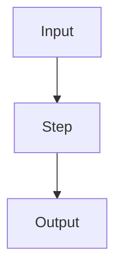
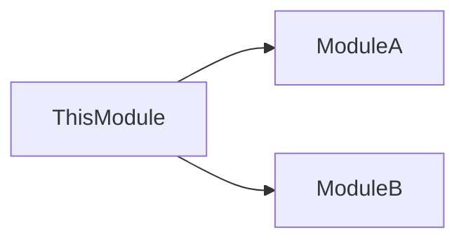

# Body Templates

Every section type has a consistent H2 structure. This predictability helps LLMs extract information reliably and helps contributors know where to put information.

---

## Feature Template

```mdx
---
(frontmatter)
---

One-line summary of what this feature does.

## Overview

What this feature is and why it exists. 2-3 paragraphs max.
Defer "why" details to linked concepts.

## Behavior

What the feature does, described in terms of user-visible or
system-visible outcomes. Use subheaders per behavior if multiple.

### Sub-behavior A

### Sub-behavior B

## Configuration

If the feature is configurable -- flags, env vars, config keys.
Skip this section if not applicable.

## Constraints

Known limitations, edge cases, or intentional exclusions.

## Related

- [Concept: X](../concepts/x.mdx) -- why we need this
- [Algorithm: Y](../algorithms/y.mdx) -- how the core logic works
- [Surface: Z](../surfaces/z.mdx) -- API endpoint for this
```

**Rules:**

- The `## Overview` section must not exceed 3 paragraphs. If more explanation is needed, extract a concept.
- The `## Behavior` section describes observable outcomes, not implementation steps.
- `## Configuration` and `## Constraints` are optional -- omit if not applicable.

---

## Concept Template

```mdx
---
(frontmatter)
---

One-line summary.

## Context

What problem or question this concept addresses.
What the reader needs to know before reading this.

## Explanation

The concept itself. Use subheaders freely.

For `comparison` type, use dedicated subsections per option
followed by a comparison table:

### Option A

### Option B

### Comparison

| Criteria | Option A | Option B |
| -------- | -------- | -------- |
| ...      | ...      | ...      |

## Decision

What we chose and why (if applicable).
If this concept is pure knowledge (prereq type), skip this section.

## Related

- Links to related concepts, algorithms
```

**Rules:**

- `comparison` type concepts must include a comparison table.
- `prereq` type concepts skip the `## Decision` section.
- `flow` type concepts should include a Mermaid diagram.

---

## Algorithm Template

````mdx
---
(frontmatter)
---

One-line summary of what this algorithm accomplishes.

## Problem

What problem this algorithm solves.
What makes it non-trivial.

## Approach

High-level description of the approach.
NOT step-by-step pseudocode. Focus on the strategy.


````

## Why This Way

The critical section. What alternatives were considered,
what roadblocks were hit, and why this approach was chosen
over simpler ones.

### Alternative: Simpler Approach X

Why it doesn't work. What breaks.

### Roadblock: Problem Y

What we ran into and how the current approach handles it.

## Trade-offs

What we gave up by choosing this approach.
Performance characteristics, complexity costs.

## Related

- Links to related concepts, algorithms

````

**Rules:**
- `## Why This Way` is the most important section. It must document rejected alternatives and roadblocks -- not just "how it works."
- `## Approach` uses a Mermaid diagram. No step-by-step pseudocode. Minimal code.
- Code snippets (if any) should be short (<15 lines) and illustrate a key insight, not the full implementation.

---

## Surface Template

```mdx
---
(frontmatter)
---

One-line summary.

## Endpoint

For API:
- **Method**: `GET`
- **Path**: `/v1/users/:id`
- **Auth**: Bearer token

For CLI:
- **Command**: `app cache clear`
- **Flags**: `--force`, `--dry-run`

## Request

Parameters, body schema, headers.
Use typed code blocks.

```typescript
interface RequestBody {
  name: string
  email: string
}
````

## Response

Response schema, status codes.

### Success (200)

```json
{
  "id": "abc",
  "name": "Example"
}
```

### Errors

| Status | Code      | Description    |
| ------ | --------- | -------------- |
| 404    | NOT_FOUND | User not found |

## Related

- Links to related surfaces, features

````

**Rules:**
- One file per endpoint/command. Never combine multiple endpoints.
- Request and response schemas use typed code blocks (TypeScript interfaces, JSON examples).
- All possible error responses are documented in a table.

---

## ADR Template

```mdx
---
(frontmatter)
---

One-line summary of the decision.

## Context

What situation or requirement prompted this decision.

## Options Considered

### Option A: Name

Pros and cons.

### Option B: Name

Pros and cons.

## Decision

What was chosen and the reasoning.

## Consequences

What changes as a result. Impact on existing code/patterns.
````

**Rules:**

- Always list at least two options in `## Options Considered`.
- `## Consequences` captures both positive and negative impacts.

---

## Module Overview Template

````mdx
---
title: 'Module Name'
description: 'One-line summary'
---

One-line summary of what this module is responsible for.

## Purpose

What bounded context this module owns.
What it is and isn't responsible for.

## Key Concepts

Brief list with links to concept files.

## Key Features

Brief list with links to feature files.

## Dependencies

What other modules this module depends on and why.


````

````

---

## Index File Template

```mdx
---
title: "Module X -- Features"
description: "Feature map for Module X"
---

## Overview

How features in this module are organized/grouped.

## By Group

### Group A

- [Feature 1](./feature-1.mdx) -- one-line description
- [Feature 2](./feature-2.mdx) -- one-line description

### Group B

- [Feature 3](./feature-3.mdx) -- one-line description
````

**Rules:**

- Every file in the directory must appear in the index. No orphans.
- Group items logically (by sub-domain, by lifecycle, by user-facing vs internal).
- Each list item has a one-line description after the link.
