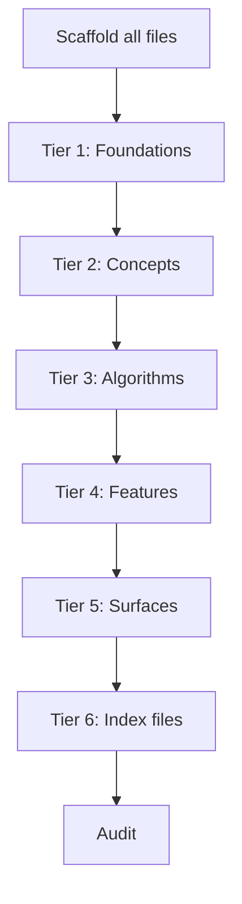

# Writing Order

When generating contributor docs, the order in which files are written matters. Writing in the wrong order causes hallucinated cross-references, duplicated content, and terminology drift.

This article defines the tier-based writing order that prevents these problems.

---

## The Core Problem

LLMs mess up docs in predictable ways:

1. **Hallucinated cross-references** -- linking to files that don't exist yet
2. **Content duplication** -- explaining a concept inline in a feature instead of linking out
3. **Terminology drift** -- calling the same thing different names across files
4. **Orphan files** -- forgetting to update index files
5. **Context pollution** -- later files contradict earlier files when written in a single context

---

## The Principle

**Write the thing being referenced before the thing that references it.**

Overviews define terms. ADRs explain decisions. Concepts explain why. Algorithms explain how. Features describe what. Surfaces describe the interface. Indexes organize everything.

---

## Phase 1: Scaffold All Files

Before writing any body content, create every file with **only frontmatter and a one-line summary**. No body content.

```mdx
---
title: 'Token Refresh'
description: 'How auth tokens are refreshed without user interaction'
date: 2026-03-03
status: draft
type: flow
tags: [auth]
related: []
---

Token refresh allows seamless re-authentication when access tokens expire.
```

This solves the hallucinated cross-reference problem. Every file path exists from the start, so any writing tier can link to any file.

---

## Phase 2: Tiered Writing

Write files in tiers. Within each tier, files can be written in parallel (by separate agents or in any order). Across tiers, the order is strict.

### Tier 1: Foundations

Written first because everything else references these.

- `00-overview.mdx`
- `02-modules.mdx`
- `03-development/` (all files)
- Each module's `overview.mdx`
- All ADRs (`01-architecture/adr-*.mdx`)
- `01-architecture/index.mdx`

### Tier 2: Concepts

Written second because features and algorithms reference them.

- `shared/concepts/` (cross-module concepts first)
- Per-module `concepts/` (all modules in parallel)

### Tier 3: Algorithms

Written third because features reference them, and they may reference concepts (now available).

- `shared/algorithms/` (cross-module algorithms first)
- Per-module `algorithms/` (all modules in parallel)

### Tier 4: Features

Written fourth. By now, concepts and algorithms exist. Features can properly link out instead of explaining inline.

- Per-module `features/` (all modules in parallel)

**Key rule:** If while writing a feature the writer discovers a missing concept or algorithm, it must stop, scaffold + write the missing file, then return to the feature. Never explain inline.

### Tier 5: Surfaces

Written fifth. Surfaces describe the interface to features, so features must exist first.

- Per-module `surfaces/` (all modules in parallel)

### Tier 6: Index Files

Written last. Indexes group and relate items. Accurate groupings require all items to have body content.

- All `features/index.mdx` files
- All `concepts/index.mdx` files
- All `algorithms/index.mdx` files
- All `surfaces/index.mdx` files
- `shared/concepts/index.mdx`
- `shared/algorithms/index.mdx`

---

## Dependency Graph



---

## Context Isolation for Parallel Writing

When multiple files are written in parallel (by separate agents), each writer receives controlled context to prevent pollution:

| Input                                          | Purpose                                                            |
| ---------------------------------------------- | ------------------------------------------------------------------ |
| The scaffolded file (with frontmatter + TODOs) | Knows what to write and what it links to                           |
| Frontmatter only of all cross-referenced files | Knows titles and descriptions of linked files without full content |
| Relevant source code files                     | The actual code being documented                                   |
| Module overview (from Tier 1)                  | Establishes terminology and boundaries                             |
| Body template for the section type             | Consistent structure                                               |
| Formatting checklist                           | Quality rules                                                      |

Writers do **not** receive the full content of other files. This prevents:

- Copying content from related files instead of linking
- Context window overflow
- Terminology drift from reading conflicting sources

---

## Post-Writing Audit

After all tiers complete, a final audit checks:

- [ ] All `related`, `concepts`, `algorithms`, `surfaces` paths in frontmatter resolve to real files with body content
- [ ] All inline `[text](path)` links resolve to real files
- [ ] No two files explain the same concept (search for content overlap)
- [ ] Terminology is consistent across files
- [ ] Every file is reachable from `00-overview.mdx` through links/indexes
- [ ] No file exceeds ~300 lines
- [ ] All code blocks have language specified
- [ ] All diagrams use Mermaid
