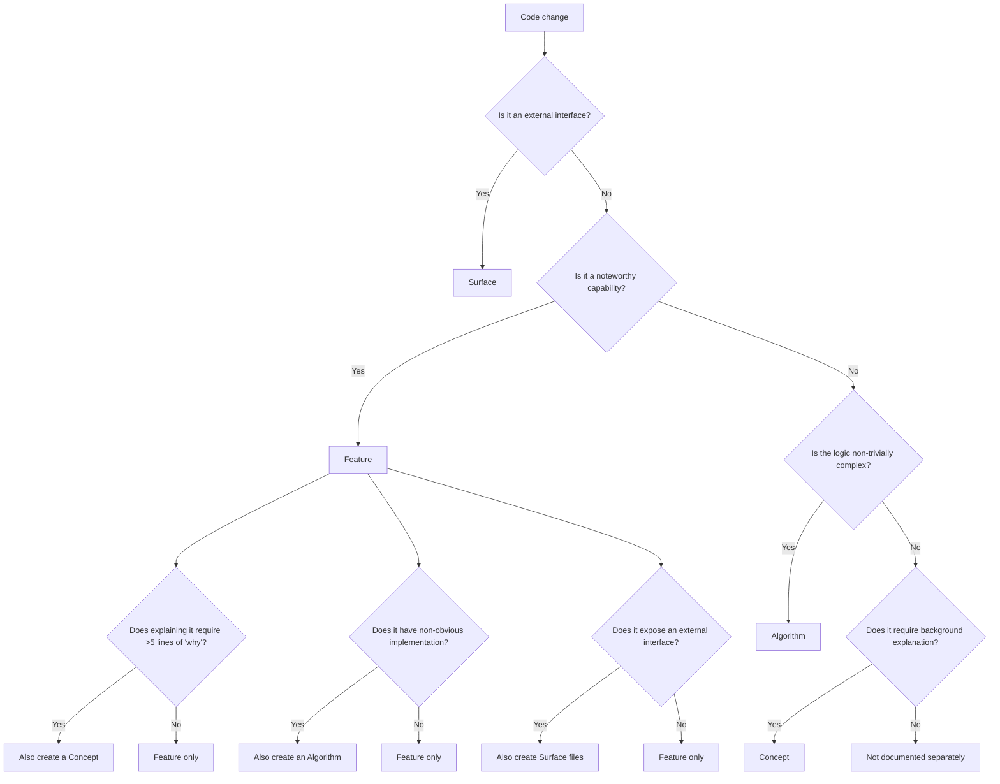

# Classification Heuristics

When analyzing a codebase to generate contributor docs, every change needs to be classified: is it a feature, a concept, an algorithm, a surface, or an ADR? This article provides detailed heuristics.

---

## Decision Flowchart

---

## Feature Heuristics

**Document as a feature when:**

- The capability has interesting mechanics worth commenting on
- A new contributor would benefit from knowing this exists and how it works
- It can be described as "the system does X" or "this module handles X"

This is contributor documentation, not user documentation. Features don't need to be user-visible. Internal mechanisms, implementation strategies, and architectural capabilities all count.

**Examples:**

- Module resolution logic
- Like button interaction mechanics
- URL-state synchronization
- Caching layer with invalidation strategy
- Webhook retry with backoff
- Build pipeline orchestration

**Not a feature:**

- Pure boilerplate with no interesting mechanics
- Dependency upgrades with no behavioral change
- Code style changes
- Trivial CRUD with no noteworthy behavior

---

## Concept Heuristics

**Document as a concept when:**

- Explaining a feature requires more than 5 lines of background or rationale
- There's a meaningful X vs Y comparison that informed the design
- A flow or process spans multiple features and needs its own explanation
- Contributors need prerequisite knowledge to understand the code

**Concept type selection:**

| Type         | Signal                                                       | Example                                           |
| ------------ | ------------------------------------------------------------ | ------------------------------------------------- |
| `comparison` | The code chose between two legitimate alternatives           | "REST vs GraphQL for our API"                     |
| `flow`       | Multiple steps across components form a process              | "Authentication flow from login to token refresh" |
| `design`     | A pattern or architecture choice affects multiple features   | "CQRS design for read/write separation"           |
| `prereq`     | Contributors need background knowledge not obvious from code | "OAuth 2.0 grant types"                           |

**Concepts can exist without features.** Common standalone concepts:

- Comparisons that inform the overall architecture
- Flows that span the entire system
- Prerequisites for understanding the domain

---

## Algorithm Heuristics

**Document as an algorithm when:**

- The implementation is non-trivially complex (not just CRUD)
- Simpler approaches were tried and rejected
- There are workarounds for known limitations
- The code would be confusing to a new contributor without context
- The "why" is more interesting than the "how"

**Examples:**

- Token bucket rate limiting (with burst handling edge cases)
- Conflict resolution in distributed state
- Incremental sync with cursor-based pagination and retry logic

**Not an algorithm:**

- Straightforward CRUD operations
- Simple sorting/filtering
- Standard library usage
- Well-known patterns applied without modification

---

## Surface Heuristics

**Document as a surface when:**

- The change exposes an external interface (API endpoint, CLI command, SDK method, event)
- External consumers need to know the contract

**Granularity: one file per endpoint/command.**

| Surface Type | One File Per                              |
| ------------ | ----------------------------------------- |
| API          | HTTP endpoint (e.g., `GET /v1/users/:id`) |
| CLI          | Command (e.g., `cache clear`)             |
| SDK          | Public method or function                 |
| Event        | Event type (e.g., `user.created`)         |

---

## ADR Heuristics

**Document as an ADR when:**

- A reasonable person could have chosen differently
- The decision affects the system architecture or multiple modules
- The rationale is not obvious from the code
- Reversing the decision later would be expensive

**Examples:**

- Choosing PostgreSQL over DynamoDB
- Adopting event sourcing for audit logs
- Using WebSockets instead of SSE for real-time updates

**Not an ADR:**

- Choosing a utility library (lodash vs ramda)
- Minor implementation choices within a function
- Decisions that are trivially reversible

---

## Module Heuristics

**Group into a module when:**

- The code has a clear bounded context (owns specific domain concepts)
- Multiple features share the same domain types or data store
- The code could theoretically be extracted into a separate service

**Examples:**

- `user-management` -- user CRUD, roles, permissions
- `payment-processing` -- charges, refunds, invoices
- `notification` -- email, SMS, push notifications

**Cross-module content** (concepts or algorithms that span multiple modules) goes in `shared/`.
