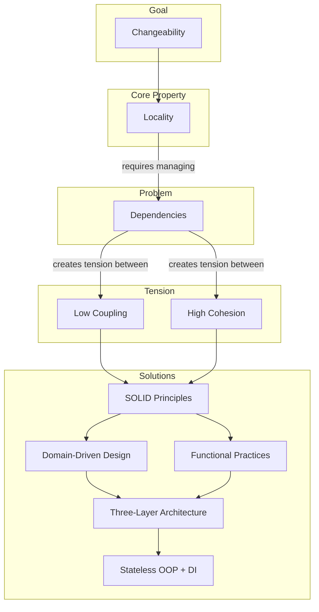

# Software Design Philosophy

_This is the foundational article in the AtomiCloud engineering series. Start here if you are new -- everything else builds on these ideas._

Everything in the AtomiCloud stack -- [SOLID Principles](../solid-principles/index.md), [Functional Practices](../functional-practices/index.md), [Domain-Driven Design](../domain-driven-design/index.md), [Three-Layer Architecture](../three-layer-architecture/index.md), and [Stateless OOP with Dependency Injection](../stateless-oop-di/index.md) -- traces back to the ideas in this article.

---

## The Goal of Software

The most important property of software is **changeability**.

Hardware can also automate tasks. What makes software dramatically more valuable is that it is _easy to change_. Software that is hard to change is just expensive hardware. Every decision we make -- how we name things, how we split files, how we wire dependencies -- should serve one goal: keeping the system easy to change over time.

This is not an abstract ideal. A codebase that is easy to change lets you ship features faster, fix bugs with confidence, and onboard new team members without fear. A codebase that is hard to change punishes you for every decision you made six months ago.

---

## Locality: The Core Property

**Locality** is the property that, within a bounded scope, you can understand everything you need without looking outside that scope.

Think of it like a physicist studying a magnetic field. When calculating the force at a specific point, they don't need to know the state of every particle in the universe. They only need to know the field in the area of interest. The field is an abstraction that captures all the relevant information locally.

```
Without locality:      To understand A, you must understand B, C, D, E...
                       To understand B, you must understand F, G, H...
                       (infinite regress)

With locality:         To understand A, you only need what's in A's boundary
                       The boundary hides complexity you don't need
```

Achieving locality requires two operations:

1. **Create boundaries** that split unrelated things apart
2. **Group related things** together inside those boundaries

The art of software design is deciding where to draw these boundaries. Draw them too small, and you fragment the system into useless pieces. Draw them too large, and you couple things that should evolve independently.

---

## Dependencies: The Root of All Problems

Everything in code is a dependency. When function `A` calls function `B`, then `A` depends on `B`. When a class reads a global variable, it is coupled to every other piece of code that writes to that global variable. Dependencies are unavoidable -- you cannot write useful code without them -- but they are also the single biggest source of pain.

Consider a simple example:

```
function A uses global variable G
function Z also uses global variable G
```

Now `A` and `Z` are coupled, even though neither one knows the other exists. A change to how `G` is structured forces changes in both `A` and `Z`. Multiply this across a real codebase and you get the kind of system where touching one file breaks three others.

The goal is never to eliminate all dependencies -- that would make the system uselessly fragmented. The goal is to **manage** dependencies so that the right things are coupled and the wrong things are not.

---

## Coupling and Cohesion: The Tension to Manage

Two properties govern how "easy to change" a system is:

**Low coupling** reduces fragility. When you change one thing, unrelated things should not break. High coupling means a small change cascades across the system in unpredictable ways.

**High cohesion** reduces rigidity. Things that change together should live together. If a single conceptual change forces you to edit ten files scattered across the codebase, cohesion is too low.

These two forces create a tension:

- Push coupling too low and you end up duplicating logic everywhere. One conceptual change now needs to be made in twelve places.
- Push cohesion too high and unrelated concerns get tangled together. One change to the display layer accidentally breaks the business logic.

---

## How These Ideas Relate



The diagram tells the story:

1. **Changeability** is our goal
2. **Locality** is the property that enables changeability
3. **Dependencies** are what we must manage to achieve locality
4. **Coupling and Cohesion** are the opposing forces in dependency management
5. **SOLID Principles** tell us when to group and when to separate
6. **Functional Practices** add constraints that eliminate entire bug categories
7. **Domain-Driven Design** shows how to model boundaries in business terms
8. **Three-Layer Architecture** structures the system around pure domains
9. **Stateless OOP + DI** wires everything together testably

---

## The Empirical Observation

These ideas did not emerge from theory. They emerged from observation.

Watch any team working on a mature codebase. You will notice patterns:

- Some files change together frequently. Edit one, and you must edit the others. This is **high cohesion** in action -- related things living together.
- Some files break unexpectedly when you touch seemingly unrelated code. This is **high coupling** -- hidden dependencies causing fragility.
- Some modules are easy to understand in isolation. Read the constructor, and you know everything it needs. This is **locality**.
- Some modules require tracing through seventeen files to understand one function. This is **failed locality**.

The principles in this series are formalizations of these observations. They give us vocabulary to discuss what we already intuitively know: code that is easy to change has good locality, low coupling, and high cohesion.

---

## What Comes Next

With these ideas established -- changeability as the goal, locality as the core property, dependencies as the root problem, and coupling vs cohesion as the tension -- we have the vocabulary to understand why every rule in the AtomiCloud codebase exists.

Continue to [SOLID Principles](../solid-principles/index.md) to learn the rules that govern how we manage dependencies.

---

## Related Articles

- [SOLID Principles](../solid-principles/index.md) -- the rules for managing dependencies
- [Functional Practices](../functional-practices/index.md) -- constraints that eliminate categories of bugs
- [Domain-Driven Design](../domain-driven-design/index.md) -- how to model the domain
- [Three-Layer Architecture](../three-layer-architecture/index.md) -- how to structure layers and boundaries
- [Stateless OOP and Dependency Injection](../stateless-oop-di/index.md) -- how to structure services and wire dependencies
